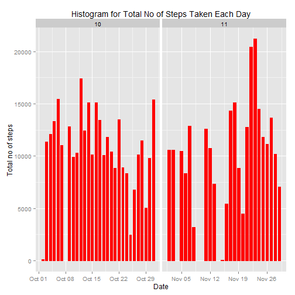
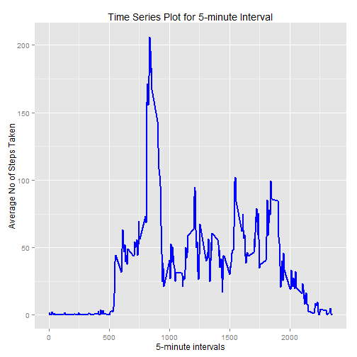
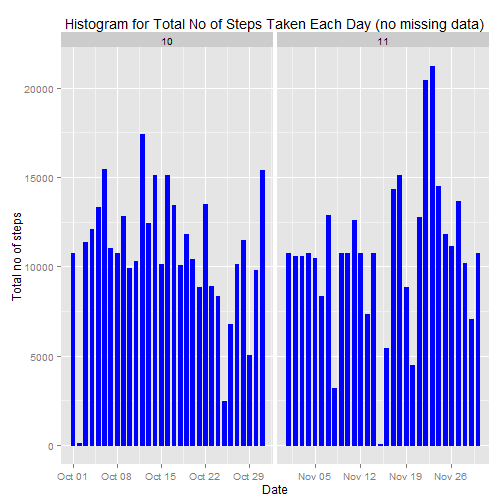
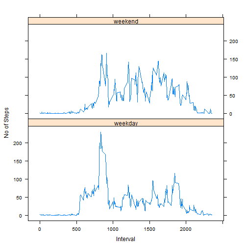

Reproducible Research: Peer Assessment 1
==========================================
Coursera June 2015  ID: repdata-015

### Display the output of a code chunk and the underlying R code 

```r
rm(list=ls(all=TRUE))
echo = TRUE
options(scipen = 1) 
```
Download the dataset required for this assignment.  Description of this data from course website: 

*This assignment makes use of data from a personal activity monitoring device. This device collects data at 5 minute intervals through out the day. The data consists of two months of data from an anonymous individual collected during the months of October and November, 2012 and include the number of steps taken in 5 minute intervals each day.*

The variables included in this dataset are:

1. **steps**: Number of steps taking in a 5-minute interval (missing values are coded as NA ) 
2. **date**: The date on which the measurement was taken in YYYY-MM-DD format 
3. **interval**: Identifier for the 5-minute interval in which measurement was taken

### Loading and preprocessing the data

```r
unzip("activity.zip")
activity <- read.csv("activity.csv", colClasses = c("integer", "Date", "factor"))
activity$month <- as.numeric(format(activity$date, "%m"))
noNAactivity <- na.omit(activity)
rownames(noNAactivity) <- 1:nrow(noNAactivity)
names(noNAactivity)
```

```
## [1] "steps"    "date"     "interval" "month"
```

```r
head(noNAactivity)
```

```
##   steps       date interval month
## 1     0 2012-10-02        0    10
## 2     0 2012-10-02        5    10
## 3     0 2012-10-02       10    10
## 4     0 2012-10-02       15    10
## 5     0 2012-10-02       20    10
## 6     0 2012-10-02       25    10
```


### What is mean total number of steps taken per day?
For this part of the assignment, you can ignore the missing values in the dataset.

* Make a histogram of the total number of steps taken each day

```r
library(ggplot2)
ggplot(noNAactivity, aes(date, steps)) + geom_bar(stat = "identity", colour = "red", fill = "red", width =0.6) + facet_grid(. ~ month, scales = "free")+ labs(title = "Histogram for Total No of Steps Taken Each Day", x = "Date", y = "Total no of steps")
```

 

* Calculate and report the mean and median total number of steps taken per day

Mean and Median total number of steps taken per day:

```r
allSteps <- aggregate(noNAactivity$steps, list(Date = noNAactivity$date), FUN = "sum")$x
mean(allSteps)
```

```
## [1] 10766.19
```

```r
median(allSteps)
```

```
## [1] 10765
```

### What is the average daily activity pattern?
1.Make a time series plot (i.e. type = "l") of the 5-minute interval (x-axis) and the average number of steps taken, averaged across all days (y-axis)


```r
averageSteps <- aggregate(noNAactivity$steps, list(interval = as.numeric(as.character(noNAactivity$interval))), FUN = "mean")
names(averageSteps)[2] <- "averageOfSteps"

head(averageSteps)
```

```
##   interval averageOfSteps
## 1        0      1.7169811
## 2        5      0.3396226
## 3       10      0.1320755
## 4       15      0.1509434
## 5       20      0.0754717
## 6       25      2.0943396
```

```r
ggplot(averageSteps, aes(interval, averageOfSteps)) + geom_line(color = "blue", size = 0.8) + labs(title = "Time Series Plot for 5-minute Interval", x = "5-minute intervals", y = "Average No of Steps Taken")
```

 

2.Which 5-minute interval, on average across all the days in the dataset, contains the maximum number of steps?

```r
averageSteps[averageSteps$averageOfSteps == max(averageSteps$averageOfSteps), ]
```

```
##     interval averageOfSteps
## 104      835       206.1698
```

### Imputing missing values
* Note that there are a number of days/intervals where there are missing values
(coded as NA). The presence of missing days may introduce bias into some
calculations or summaries of the data

 1.Calculate and report the total number of missing values in the dataset:


```r
sum(is.na(activity))
```

```
## [1] 2304
```

 2.Devise a strategy for filling in all of the missing values in the dataset. The strategy does not need to be sophisticated. For example, you could use
the mean/median for that day, or the mean for that 5-minute interval, etc.

 3.Create a new dataset that is equal to the original dataset but with the
missing data filled in.


```r
newactivity <- activity 
for (i in 1:nrow(newactivity)) {
    if (is.na(newactivity$steps[i])) {
        newactivity$steps[i] <- averageSteps[which(newactivity$interval[i] == averageSteps$interval), ]$averageOfSteps
    }
}

head(newactivity)
```

```
##       steps       date interval month
## 1 1.7169811 2012-10-01        0    10
## 2 0.3396226 2012-10-01        5    10
## 3 0.1320755 2012-10-01       10    10
## 4 0.1509434 2012-10-01       15    10
## 5 0.0754717 2012-10-01       20    10
## 6 2.0943396 2012-10-01       25    10
```

```r
sum(is.na(newactivity))
```

```
## [1] 0
```

 4.Make a histogram of the total number of steps taken each day and Calculate
and report the mean and median total number of steps taken per day 


```r
ggplot(newactivity, aes(date, steps)) + geom_bar(stat = "identity",
                                             colour = "blue",
                                             fill = "blue",
                                             width = 0.6) + facet_grid(. ~ month, scales = "free") + labs(title = "Histogram for Total No of Steps Taken Each Day (no missing data)", x = "Date", y = "Total no of steps")
```

 

Do these values differ from the estimates from the first part of the assignment? What is the impact of imputing missing data on the estimates of the total daily number of steps?

New Mean and Median total number of steps taken per day:

```r
newallSteps <- aggregate(newactivity$steps, 
                           list(Date = newactivity$date), 
                           FUN = "sum")$x
newMean <- mean(newallSteps)
newMedian <- median(newallSteps)
oldMean <- mean(allSteps)
oldMedian <- median(allSteps)
newMean - oldMean
```

```
## [1] 0
```

```r
newMedian - oldMedian
```

```
## [1] 1.188679
```
Result: mean remain the same and median is greather that before.

### Are there differences in activity patterns between weekdays and weekends?

* Create a new factor variable in the dataset with two levels -- "weekday" and "weekend" indicating whether a given date is a weekday or weekend day.


```r
head(newactivity)
```

```
##       steps       date interval month
## 1 1.7169811 2012-10-01        0    10
## 2 0.3396226 2012-10-01        5    10
## 3 0.1320755 2012-10-01       10    10
## 4 0.1509434 2012-10-01       15    10
## 5 0.0754717 2012-10-01       20    10
## 6 2.0943396 2012-10-01       25    10
```

```r
newactivity$dayofweek <- factor(format(newactivity$date, "%A"))
levels(newactivity$dayofweek) <- list(weekday = c("Monday", "Tuesday",
                                             "Wednesday", 
                                             "Thursday", "Friday"),
                                 weekend = c("Saturday", "Sunday"))
levels(newactivity$dayofweek)
```

```
## [1] "weekday" "weekend"
```

```r
table(newactivity$dayofweek)
```

```
## 
## weekday weekend 
##   12960    4608
```

* Make a panel plot containing a time series plot (i.e. type = "l") of the
5-minute interval (x-axis) and the average number of steps taken, averaged
across all weekday days or weekend days (y-axis).


```r
averageSteps <- aggregate(newactivity$steps, 
                      list(interval = as.numeric(as.character(newactivity$interval)), 
                           weekdays = newactivity$dayofweek),
                      FUN = "mean")
names(averageSteps)[3] <- "averageOfSteps"

library(lattice)

xyplot(averageSteps$averageOfSteps ~ averageSteps$interval | averageSteps$weekdays, 
       type = 'l',
       xlab = 'Interval',
       ylab = 'No of Steps',
       layout = c(1,2))
```

 

### Note: Command to generate md and html file
*  knitr::knit2html(input = "PA1_template.Rmd",  output = "PA1_template.html")
